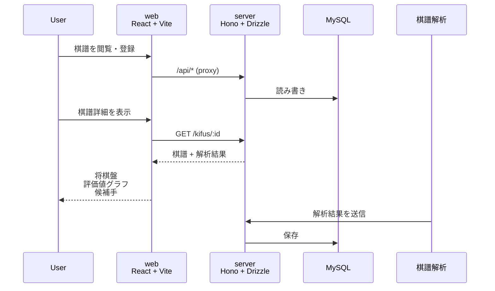
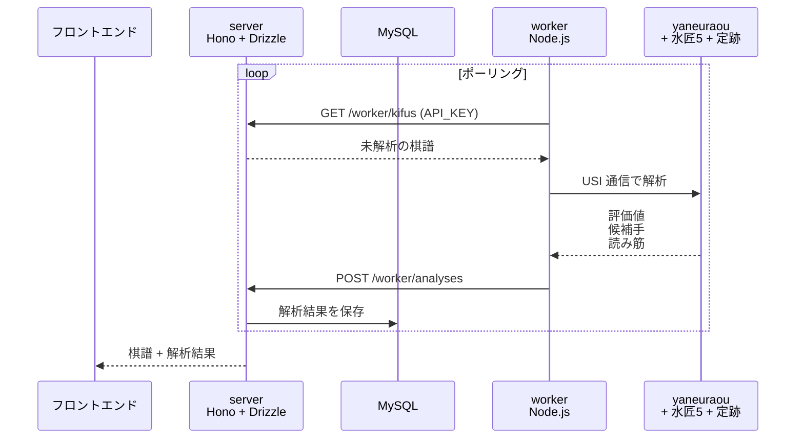

# 細流棋（seseraki） - 自動棋譜取得 & 解析

棋譜解析を行う Web アプリ。

自動で棋譜を取得し解析にかけ、結果を web で確認する流れを「せせらぎ」に見立て、

その古い読み方・表記である「せせらき」と棋譜解析機能を表した名前を付けました。

## システム構成

### フロントエンド



### 棋譜解析



## 技術スタック

| パッケージ | 役割        | 主要技術                                                |
| ---------- | ----------- | ------------------------------------------------------- |
| web        | 棋譜管理 UI | React 19, Vite, TanStack Router, Tailwind CSS + daisyUI |
| server     | API + DB    | Hono, Drizzle ORM, MySQL, zod                           |
| worker     | 棋譜解析    | USI プロトコル, やねうら王                              |

## 開発

```bash
pnpm dev    # docker compose watch で全サービス起動
```

- web: http://localhost:5173
- server: http://localhost:4000

## そもそも

解析エンジンを載せるサーバーはある程度のスペックが必要です。

インフラ管理費が必要な分、既存の解析サービスを使ったり、将棋エンジン開発者をサポートした方が得られるリターンは大きいかも...?

## 利用ソフトウェア

- [やねうら王](https://github.com/yaneurao/YaneuraOu) (GPL-3.0) — 将棋エンジン
- [水匠5](https://github.com/yaneurao/YaneuraOu/releases/tag/suisho5) — NNUE 評価関数
- [ペタブック定跡](https://github.com/yaneurao/YaneuraOu/releases/tag/new_petabook233) (MIT) — 定跡データベース
